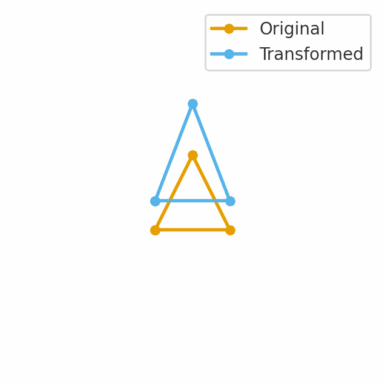

# Taller 0 — Transformaciones
Fecha: 2025-09-13

---

## Objetivo del Taller
Explorar y aplicar transformaciones geométricas básicas (traslación, rotación y escala) sobre un objeto 2D, animar estas transformaciones en el tiempo y documentar los resultados visuales en `resultados/`.

---

## Conceptos Aprendidos
- [x] Transformaciones geométricas (traslación, rotación, escala)

---

## Herramientas y Entornos
- Lenguaje: Python
- Dependencias principales (archivo en `entorno/requirements.txt`):
  - numpy
  - matplotlib
  - imageio
- Entorno recomendado: entorno virtual Python (venv) o Google Colab para ejecución sin GPU dedicada.

---

## Estructura del Proyecto
```
2025-10-14_taller_0_transformaciones/
├── python/                 # código Python y scripts de ejecución
├── datos/                  # imágenes, audio, modelos, video (si aplica)
├── resultados/             # capturas, métricas, gifs
├── entorno/                # requirements.txt u otras instrucciones de entorno
├── README.md               # este archivo
```

---

## Implementación
### Etapas realizadas
1. Preparación del objeto 2D de trabajo (triángulo).
2. Implementación de matrices homogéneas para combinaciones de escalado, rotación y traslación.
3. Generación de una animación de transformaciones dependiente del tiempo.
4. Exportación de resultado animado como GIF en `resultados/`.

### Archivos incluidos
- `python/untitled0.py` — código original proporcionado.
- `python/run_transformations.py` — script que genera `resultados/transformaciones_demo.gif`.
- `entorno/requirements.txt` — lista de dependencias.

---

## Resultados Visuales
El GIF generado por este entregable se encuentra en:
- `resultados/transformaciones_demo.gif`

Inserción de ejemplo (Markdown):
```markdown

```

---

## Prompts Usados
No aplica.

---

## Reflexión Final
En este taller ejercité la formulación y aplicación de transformaciones geométricas mediante matrices homogéneas, lo que permitió comprender cómo combinar escalado, rotación y traslación en un único operador lineal-afín. El proceso de animar las transformaciones facilitó observar el efecto acumulado de cada componente (escala, rotación, traslación) sobre la geometría y la importancia de la convención de orden en la multiplicación de matrices.

---

## Contribuciones Grupales
Trabajo individual — autor: Miguel Ángel

---

## Checklist de Entrega
- [ ] Carpeta `2025-10-14_taller_0_transformaciones/` con la estructura mínima presente
- [ ] `entorno/requirements.txt` incluido
- [ ] `python/` con `untitled0.py` y `run_transformations.py`
- [ ] `resultados/transformaciones_demo.gif` presente
- [ ] `README.md` completado (este archivo)
- [ ] Commits descriptivos en inglés

---

## Código relevante (fragmento)
```python
# Uso de matrices homogéneas para combinar transformaciones
M = S @ R @ T  # escalado, rotación y traslación combinadas
transformed = (M @ triangle_h.T).T
```

---

## Referencias / Notas adicionales
- Generar GIF: `python python/run_transformations.py`
- Archivo de dependencias: `entorno/requirements.txt`

---

## Contacto
- Autor: Miguel Ángel
- Correo: miamartinezfe@unal.edu.co
